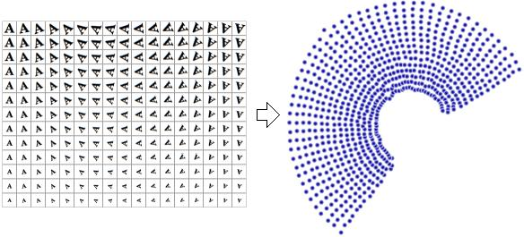

## Related works
- Recent related works, especially manifold learning

- Manifold learning
  - Nonlinear dimensionality reduction approach
    - Dimensionality reduction
      - [Goal](): Visualize the high-dimensional data on low dimensional subspace which is embedded in the high dimensional space (input feature space)
      - [Linear Methods](): 
        - Principal Component Analysis (PCA)
        - Singular Value Decomposition (SVD)
      - [Nonlinear Methods](): 
        - Nonlinear PCA (Kernel Tricks)
        - t-SNE (t-distributed stochastic neighbor embedding)
        - UMAP (Uniform Manifold Approximation and Projection for Dimension Reduction)
## [Manifold Learning](https://en.wikipedia.org/wiki/Nonlinear_dimensionality_reduction)
__Manifold Learning__
- known as Nonlinear dimensionality reduction (**NLDR**)

    **Goal**: Projects high-dimensional data onto lower-dimensional latent manifolds

    **Application**: Visualization of the high-dim data in the low-dim subspace

__The dimensionality of discourse__
- As the number of features (attributes) of the data is getting bigger, sampling data from the feature space becomes more difficult
- Higher dimensional data requires more data samples to be able to describe the data distribution
- High-dimensional input causes high time complexity and difficulty to describe the data distribution
- __KNN__ is one of examples which does not work with high-dim inputs
  - Nearest neighbor is not "nearest" at all.

__Visuallization for understanding of the data in high dimensions__
- Humans often have difficulty discerning structure of data in high dimension
- Reducing dimensionality of the high-dim data is useful for visualization purposes

__Intrinsic variable (Latent factors, Manifolds, Latent Variables)__
- The reduced-dim representations of data are often referred to as **Intrinsic Variables**
- These variables has ability to restore the corresponding original high-dim data
- Each high-dim data has individual intrinsic variable

**Example**

We have a dataset that contains images of a letter 'A', which has been scaled and rotated by varying amounts. The intrinsic dimensionality is two, because variables (rotation and scale) were varied in order to produce the data. 
- Intrinsic variables
  - Rotation
  - Scale
- Other variables
  - a letter 'A' (this variable is same in every instance)

Nonlinear dimensionality reduction will discard the correlated information (letter 'A'). 

By using a linear dimensionality reduction (PCA), we can not reduce the dimensionality with organized structure.
This is because the method is only obtain the **global** principal components (global linear structure). 

__Linear dimensionality reduction (LDR)__

Find a global most variant direction by using eigendecomposition. 
Try to find a low dimensional linear projection (diagonal projection) such that each direction is uncorrelated (independent with each other and covariance matrix is diagonal matrix) and you can remove low-variant direction.

This means that linear dimensionality reduction can only consider global structure of given data, and they do not consider local structure such that how far each sample is with each other and what kind of relationship do they have.

It often happens that linear separable data sets are projected onto a single principal component, and they can be seen as neighbor, but actually they are not. In other words, linear dimensionality reduction can not capture local structure and actually ignore them.

__NLDR techniques__

### Sammon's mapping (one of the first and most popular NLDR), 1969

    This technique has been used as an approach of analyzing datasets for exploratory data analysis (EDA) in order to summarize their main characteristics.

    Basically, this technique tries to preserve the distance between ith and jth samples in original high-dim space and also in the low-dim subspace.

    Optimization problem to minimize the inter-point distances error between in original space and low-dimensional space

    Algorithm (sammon's mapping) maps a high-dim space to a space of lower dimensionality by trying to preserve **the structure of inter-point distances** in high-dimensional space in the lower-dimension projection.

**Algorithm**

Let $d_{ij}^*$ be denoted as the distance between the $\mathbf{i}$th and $\mathbf{j}$th samples in the original space and $d_{ij}$ be denoted as the distance between their projections.

Sammon's mapping aims to minimize the following objective function (Sammon's stress)

$$
\mathbf{E} = \frac{1}{\sum_{i<j}d_{ij}^*} \sum_{i<j}\frac{(d_{ij}^* - d_{ij})}{d_{ij}^*}
$$

Similar to the __weighted K nearest neighbors__ by the inverse of the distance.

Minimization is performed by gradient descent. 
Using initialization with PCA results is preferred as a starting configuration.

__Kernel principal component analysis__

Perhaps the most widely used algorithm for dimensional reduction is kernel PCA. PCA begins by computing the covariance matrix of the m x n matrix $\mathbf{X}$

$$
\mathbf{C} = \frac{1}{m}\sum_{i=1}^m \mathbf{\Phi}(\mathbf{x_i}) \mathbf{\Phi}(\mathbf{x_i})^T
$$

Kernel PCA begins by transforming original data into a higher-dimensional space. 

__t-distributed stochastic neighbor embedding (t-SNE)__

A statistical method for visualizing high0dimensional data by giving each data point a location in a two or three-dimensional map. It is based on Stochastic Neighbor Embedding.
The t-SNE

- How to use t-SNE effectively
    
    https://distill.pub/2016/misread-tsne/?_ga=2.135835192.888864733.1531353600-1779571267.1531353600

